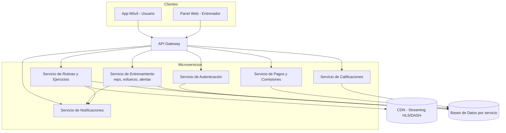

# 5. Arquitectura de Software (Unidad 6)

## ¿Qué arquitectura propones?

Se propone una arquitectura de **Microservicios con API Gateway**, complementada con un patrón **MVC** dentro de cada cliente (app móvil y panel web de entrenadores) para organizar su capa de presentación.

## ¿Por qué se eligió esta arquitectura para FitConnect?

Porque los requisitos técnicos ya relevados en el Punto 2 (Requisito Técnico 1) exigen escalar de forma independiente módulos con cargas y criticidad muy distintas: autenticación, streaming de video, seguimiento de entrenamiento y pagos/comisiones no crecen al mismo ritmo ni tienen el mismo nivel de exigencia. Diego (CTO) ya había fijado restricciones concretas —APK < 200MB, cold start < 3s, streaming HLS/DASH vía CDN y 99,5% de uptime— que son mucho más fáciles de cumplir si cada capacidad se despliega, escala y actualiza por separado.

## ¿Qué características del proyecto la hacen apropiada?

- **Picos de uso dispares:** el servicio de streaming de video se satura en horarios pico de entrenamiento, mientras que el de pagos tiene carga constante y baja; los microservicios permiten escalar solo lo que hace falta.
- **Equipos y ritmos de entrega distintos:** el módulo de pagos/comisiones tiene reglas legales y de negocio que cambian con frecuencia (Mara, Legal), mientras que el módulo de rutinas cambia según feedback de producto; separarlos evita que un cambio en uno rompa al otro.
- **Restricción de tamaño de instalador:** al delegar el contenido pesado (video) a un servicio de streaming externo vía CDN, el cliente permanece liviano y cumple el límite de 200MB.
- **Modelo de ciclo de vida incremental** ya definido en la Primera Etapa: los microservicios encajan naturalmente con entregas incrementales, ya que cada servicio puede liberarse y probarse por separado sin re-desplegar todo el sistema.

## Diagrama de alto nivel

## Ventajas que aporta esta arquitectura al proyecto

- **Escalabilidad independiente:** permite escalar el servicio de streaming o el de entrenamiento en horas pico sin sobredimensionar el resto.
- **Despliegue incremental:** encaja con el modelo de ciclo de vida incremental elegido en la Primera Etapa, permitiendo lanzar y ajustar el MVP por partes.
- **Aislamiento de fallas:** si el servicio de pagos falla, el usuario igual puede entrenar y registrar su sesión, evitando que un incidente tire abajo toda la app (clave para sostener el 99,5% de uptime).
- **Cumplimiento de restricciones legales por dominio:** el servicio de Pagos y el de datos sensibles (fotos, salud) pueden aislarse con controles de seguridad más estrictos (TLS 1.3, AES-256) sin sobrecargar al resto del sistema.

## Desventajas o desafíos que presenta

- **Complejidad operativa:** requiere infraestructura de orquestación (contenedores, CI/CD por servicio) y monitoreo distribuido, lo cual exige más experiencia técnica del equipo que un monolito.
- **Latencia por comunicación entre servicios:** cada operación que cruza varios microservicios (por ejemplo, ver el progreso de un alumno) implica múltiples llamadas internas, lo que puede afectar el objetivo de performance si no se optimiza el Gateway.
- **Consistencia de datos:** al tener una base de datos por servicio, mantener la consistencia entre, por ejemplo, el estado de la suscripción (Pagos) y el acceso a rutinas premium (Rutinas) requiere mecanismos adicionales (eventos, colas) que agregan complejidad.
