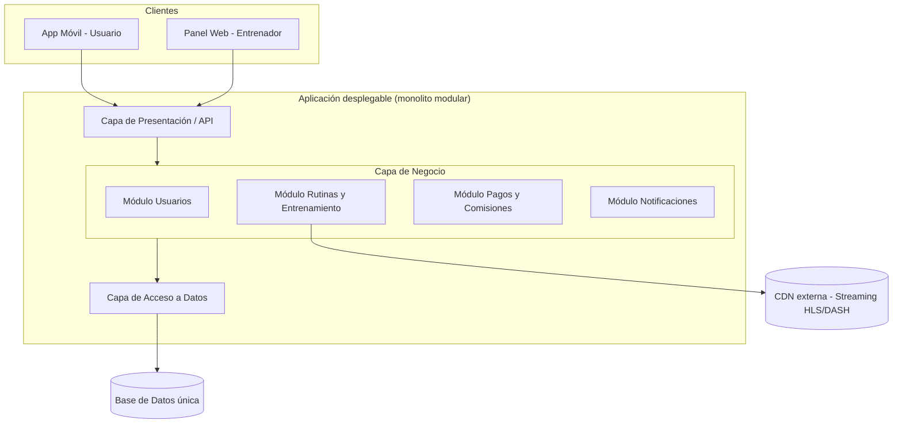

# Puntos trabajados por Agustín Curvetto

**FitConnect – Trabajo Práctico Segunda Etapa**
Este archivo contiene el desarrollo del **Punto 1 (Técnicas de elicitación)** y el **Punto 5 (Arquitectura de software)**, separados en dos secciones independientes.

---
---

# 🟦 PUNTO 1

# 1. Técnicas de Recolección de Requisitos (Unidad 4)

Para FitConnect elegimos dos técnicas de elicitación complementarias: una cualitativa y profunda (**Entrevistas**) y otra cuantitativa y masiva (**Encuestas / Cuestionarios**). La combinación permite validar en profundidad las necesidades de los perfiles clave (entrenadores, usuarios activos) y, al mismo tiempo, confirmar con números si esas necesidades se repiten en el resto del mercado objetivo.

---

## Técnica 1: Entrevistas

**Descripción del proceso — ¿Cómo se aplicaría en FitConnect?**

Se realizarían entrevistas semiestructuradas individuales a los distintos perfiles de stakeholders identificados en la Primera Etapa:

- **Ana (Head de Entrenadores)** y 2-3 entrenadores externos, para entender cómo arman rutinas hoy (Excel, WhatsApp) y qué necesitan de un panel de control.
- **Enzo (usuario activo)** y 3-4 usuarios nuevos, para relevar el miedo a lesionarse, la falta de motivación y qué esperan del onboarding.
- **Gabriel (Product Manager)** y **Diego (CTO)**, para confirmar restricciones de negocio (conversión, churn) y técnicas (APK < 200MB, uptime 99,5%).

Cada entrevista se guía con una lista de preguntas abiertas ("Contame cómo armás hoy la rutina de un alumno a distancia"), dejando lugar a repreguntas según lo que surja. Se graban (con consentimiento) y se transcriben para extraer requisitos candidatos.

**¿Qué información permitiría obtener?**

- Motivaciones y frustraciones reales de entrenadores y usuarios, con ejemplos concretos.
- Detalles del flujo actual de trabajo (cómo siguen el progreso de un alumno, cómo cobran, cómo entrenan solos) que no aparecen en un documento de enunciado.
- Prioridades y matices que permiten refinar los criterios de aceptación de las historias de usuario.

**Dificultad**

Los entrenadores tienen agendas muy ajustadas (dan clases, atienden alumnos) y coordinar horarios para la entrevista es difícil; además, al ser una técnica 1 a 1, la cantidad de personas que se puede entrevistar es limitada y el resultado puede sesgarse hacia la opinión de quienes sí tuvieron tiempo de participar (sesgo de disponibilidad).

---

## Técnica 2: Encuestas / Cuestionarios

**Descripción del proceso — ¿Cómo se aplicaría en FitConnect?**

Se diseñaría un cuestionario online (Google Forms o Typeform) de 10-15 preguntas cerradas (escala Likert, opción múltiple) más 1-2 abiertas, distribuido a:

- Usuarios de la comunidad de calistenia y redes sociales de fitness, para medir cuánta gente sufre el problema de "no tener plata/tiempo para el gimnasio".
- Entrenadores freelance, para cuantificar cuántos usan hoy herramientas informales (Excel/WhatsApp) y cuánto pagarían/qué comisión aceptarían.

Preguntas ejemplo: "¿Cuántas veces abandonaste una rutina de entrenamiento por miedo a lastimarte?", "¿Pagarías una suscripción premium si incluye seguimiento de un entrenador real?".

**¿Qué información permitiría obtener?**

- Datos cuantitativos (porcentajes, promedios) que permiten priorizar problemas por volumen de gente afectada, validando el orden de impacto definido en la Primera Etapa (captar → retener → organizar).
- Segmentación de usuarios (principiantes vs. avanzados) útil para definir criterios de aceptación de las historias de usuario relacionadas con onboarding y progresión.

**Dificultad**

Las respuestas cerradas no permiten indagar el "por qué" detrás de una opinión, y suele haber una tasa de respuesta baja o sesgada (solo contestan quienes ya están interesados en fitness/apps), lo que puede dar una imagen poco representativa del usuario promedio que FitConnect quiere captar.

---

## Validación cruzada con los Criterios de Aceptación del MVP (Punto 3)

Las entrevistas no solo relevan necesidades nuevas: también sirven para **confirmar o refutar con los propios stakeholders** las 4 métricas de aceptación técnica ya definidas en el Punto 3 (Análisis de Stakeholders). Por eso, dentro de la guía de preguntas de cada entrevista se incluye una pregunta puntual atada a cada métrica:

| Métrica de aceptación (Punto 3) | Stakeholder a validar | Pregunta de entrevista que la valida |
|---|---|---|
| **Interfaz:** onboarding en máximo 3 taps | Gabriel (PM) y usuarios nuevos | "Si tuvieras que registrarte y arrancar a entrenar en menos de 3 toques, ¿qué información estarías dispuesto a saltear o completar después?" |
| **Contenido mínimo:** al menos 3 plantillas estáticas por entrenador | Ana y entrenadores externos | "De las rutinas que ya usás con tus alumnos, ¿cuáles 3 elegirías como plantillas base si tuvieras que dejarlas precargadas en la app?" |
| **Rendimiento de infraestructura:** APK < 200MB, carga < 3s | Diego (CTO) | "¿Qué contenido creés que NO puede vivir localmente en el dispositivo sin romper el límite de 200MB, y cómo lo resolverías con streaming?" |
| **Seguridad:** cifrado TLS 1.3 / AES-256, consentimiento opt-in | Mara (Legal) | "¿Qué tipo de consentimiento necesitamos pedirle al usuario antes de guardar una foto de progreso, y qué pasa si no lo da?" |

**¿Por qué esto responde al feedback del profesor?** Porque asegura que los Criterios de Aceptación del MVP no queden como una definición unilateral del equipo, sino que estén **corroborados por la fuente original** (el propio stakeholder que puso esa restricción), cerrando el círculo entre lo que se definió en el Punto 3 y lo que efectivamente se relevó en campo en el Punto 1.

---
---

# 5. Arquitectura de Software (Unidad 6)

## ¿Qué arquitectura propones?

Se propone una arquitectura **Cliente-Servidor organizada en Capas**, implementada como un **monolito modular** (una única aplicación desplegable, dividida internamente en módulos con límites claros: Usuarios, Rutinas/Entrenamiento, Pagos y Comisiones, Notificaciones). El contenido audiovisual (video de ejercicios) se resuelve aparte, delegado a un servicio de **CDN externo** con streaming HLS/DASH — esto es una decisión de infraestructura, no exige por sí sola una arquitectura de microservicios.

## ¿Por qué se eligió esta arquitectura para FitConnect?

Siguiendo el criterio de selección visto en la materia ("elegir una opción suficientemente simple para la evidencia disponible"), se descartó microservicios como punto de partida:

- **No hay evidencia de que se necesiten** — FitConnect es un MVP recién arrancando, con un dominio todavía acotado (usuarios, rutinas, pagos) y sin límites de negocio probados en producción.
- **El equipo es pequeño** — se menciona un solo CTO (Diego) a cargo de la infraestructura; no hay evidencia de múltiples equipos autónomos que necesiten desplegar sus propios servicios de forma independiente.
- **El plazo es corto** (3 meses para el MVP) — la complejidad operativa de microservicios (orquestación, observabilidad distribuida, despliegues coordinados) consumiría tiempo que el proyecto no tiene todavía.
- **Los requisitos de Diego no exigen microservicios** — el streaming de video ya se resuelve con una CDN externa (una decisión de infraestructura, no de arquitectura de la aplicación), y las transacciones de pagos/suscripciones se benefician de la **consistencia fuerte** que un monolito con una sola base de datos ofrece más fácilmente que un sistema distribuido.

## ¿Qué características del proyecto la hacen apropiada?

- **Dominio acotado para el MVP:** las funcionalidades iniciales (registro, rutinas, seguimiento de entrenamiento, panel de entrenador) están relacionadas y se pueden razonar como una sola unidad todavía.
- **Necesidad de consistencia en pagos:** el cálculo de comisiones (20%-30%) y el estado de las suscripciones premium requieren transacciones confiables; un monolito con una única base de datos evita la complejidad de consistencia eventual entre servicios distribuidos.
- **Restricción de equipo y tiempo:** con un plazo de 3 meses y un equipo técnico chico, un monolito modular permite simplicidad de despliegue y depuración mientras se valida el producto en el mercado.
- **Separación interna por módulos:** aunque es un solo desplegable, cada módulo (Rutinas, Pagos, Notificaciones) mantiene responsabilidades cohesivas, lo que deja abierta la puerta a extraer un módulo puntual en el futuro si aparece evidencia real de que lo necesita.

## Alternativas consideradas y descartadas

| Alternativa | Por qué se descartó |
|---|---|
| **Microservicios** | Sin evidencia de límites de dominio maduros ni de necesidad real de escalado independiente; el equipo chico no justifica el costo operativo (observabilidad distribuida, despliegues coordinados, fallos parciales). |
| **Cliente-Servidor sin capas internas** | No separaría responsabilidades (presentación, reglas de negocio, acceso a datos), dificultando el mantenimiento a medida que crece el catálogo de rutinas y ejercicios. |
| **Arquitectura basada en eventos (como estilo principal)** | Introduciría complejidad de consistencia eventual y depuración distribuida que el proyecto no necesita todavía; se reserva como mecanismo puntual dentro del monolito para las notificaciones asincrónicas. |

## Diagrama de alto nivel

## Ventajas que aporta esta arquitectura al proyecto

- **Simplicidad de despliegue y depuración:** un solo componente para desplegar, monitorear y versionar, ideal para el ritmo acelerado del MVP.
- **Transacciones simples y consistencia fuerte:** las reglas de negocio (comisión, suscripción, disponibilidad de un plan premium) se resuelven sobre una única base de datos, sin necesitar mecanismos de consistencia eventual.
- **Menor costo operativo:** no requiere un equipo dedicado a infraestructura distribuida (orquestación de contenedores, service mesh, tracing distribuido) que el equipo actual no tiene.
- **Camino de evolución abierto:** al mantener límites modulares claros desde el día uno, si en el futuro aparece evidencia real de que un módulo puntual necesita escalar o desplegarse de forma independiente (el candidato más probable sería el módulo de Rutinas si el catálogo de contenido crece mucho), se puede extraer ese módulo específico sin rediseñar todo el sistema.

## Desventajas o desafíos que presenta

- **Escalado parcial limitado:** si una funcionalidad puntual (por ejemplo, el módulo de Rutinas en horarios pico) recibe mucha carga, obliga a escalar toda la aplicación en lugar de solo esa parte.
- **Riesgo de acoplamiento interno:** si no se respetan los límites modulares definidos, el código puede volverse difícil de mantener a medida que el equipo crece.
- **Punto único de fallo:** un error en un módulo puede, en el peor caso, afectar la disponibilidad de toda la aplicación si no se implementan mecanismos internos de aislamiento (por ejemplo, timeouts y manejo de excepciones por módulo).

## Registro de la decisión (ADR resumido)

| Campo | Detalle |
|---|---|
| **Contexto y problema** | Se necesita una arquitectura de alto nivel para el MVP de FitConnect, a lanzar en 3 meses. |
| **Requisitos y restricciones** | Consistencia en pagos/suscripciones, equipo técnico chico, dominio todavía acotado, límite de infraestructura (APK < 200MB, uptime 99,5%). |
| **Alternativas consideradas** | Microservicios, Cliente-Servidor sin capas, Arquitectura basada en eventos como estilo principal. |
| **Decisión adoptada** | Cliente-Servidor en Capas, como monolito modular, con CDN externa para streaming de video. |
| **Consecuencias y forma de revisarla** | Se acepta el riesgo de escalado parcial limitado. Se revisará esta decisión si aparece evidencia concreta (métricas de carga o incidentes) de que un módulo específico necesita desplegarse de forma independiente. |
