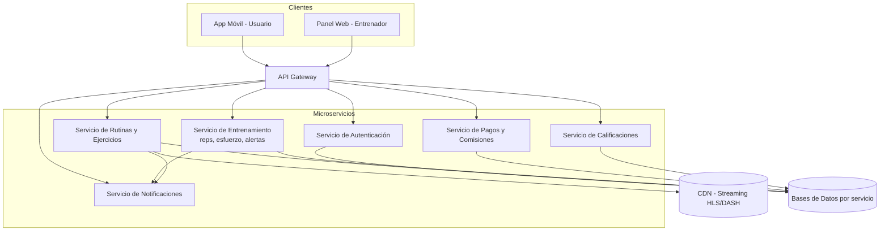

# Puntos trabajados por Agustín Curvetto

**FitConnect – Trabajo Práctico Segunda Etapa**
Este archivo contiene el desarrollo del **Punto 1 (Técnicas de elicitación)** y el **Punto 5 (Arquitectura de software)**, separados en dos secciones independientes.

---
---

# 🟦 PUNTO 1

# 1. Técnicas de Recolección de Requisitos (Unidad 4)

Para FitConnect elegimos dos técnicas de elicitación complementarias: una cualitativa y profunda (**Entrevistas**) y otra cuantitativa y masiva (**Encuestas / Cuestionarios**). La combinación permite validar en profundidad las necesidades de los perfiles clave (entrenadores, usuarios activos) y, al mismo tiempo, confirmar con números si esas necesidades se repiten en el resto del mercado objetivo.

---

## Técnica 1: Entrevistas

**Descripción del proceso — ¿Cómo se aplicaría en FitConnect?**

Se realizarían entrevistas semiestructuradas individuales a los distintos perfiles de stakeholders identificados en la Primera Etapa:

- **Ana (Head de Entrenadores)** y 2-3 entrenadores externos, para entender cómo arman rutinas hoy (Excel, WhatsApp) y qué necesitan de un panel de control.
- **Enzo (usuario activo)** y 3-4 usuarios nuevos, para relevar el miedo a lesionarse, la falta de motivación y qué esperan del onboarding.
- **Gabriel (Product Manager)** y **Diego (CTO)**, para confirmar restricciones de negocio (conversión, churn) y técnicas (APK < 200MB, uptime 99,5%).

Cada entrevista se guía con una lista de preguntas abiertas ("Contame cómo armás hoy la rutina de un alumno a distancia"), dejando lugar a repreguntas según lo que surja. Se graban (con consentimiento) y se transcriben para extraer requisitos candidatos.

**¿Qué información permitiría obtener?**

- Motivaciones y frustraciones reales de entrenadores y usuarios, con ejemplos concretos.
- Detalles del flujo actual de trabajo (cómo siguen el progreso de un alumno, cómo cobran, cómo entrenan solos) que no aparecen en un documento de enunciado.
- Prioridades y matices que permiten refinar los criterios de aceptación de las historias de usuario.

**Dificultad**

Los entrenadores tienen agendas muy ajustadas (dan clases, atienden alumnos) y coordinar horarios para la entrevista es difícil; además, al ser una técnica 1 a 1, la cantidad de personas que se puede entrevistar es limitada y el resultado puede sesgarse hacia la opinión de quienes sí tuvieron tiempo de participar (sesgo de disponibilidad).

---

## Técnica 2: Encuestas / Cuestionarios

**Descripción del proceso — ¿Cómo se aplicaría en FitConnect?**

Se diseñaría un cuestionario online (Google Forms o Typeform) de 10-15 preguntas cerradas (escala Likert, opción múltiple) más 1-2 abiertas, distribuido a:

- Usuarios de la comunidad de calistenia y redes sociales de fitness, para medir cuánta gente sufre el problema de "no tener plata/tiempo para el gimnasio".
- Entrenadores freelance, para cuantificar cuántos usan hoy herramientas informales (Excel/WhatsApp) y cuánto pagarían/qué comisión aceptarían.

Preguntas ejemplo: "¿Cuántas veces abandonaste una rutina de entrenamiento por miedo a lastimarte?", "¿Pagarías una suscripción premium si incluye seguimiento de un entrenador real?".

**¿Qué información permitiría obtener?**

- Datos cuantitativos (porcentajes, promedios) que permiten priorizar problemas por volumen de gente afectada, validando el orden de impacto definido en la Primera Etapa (captar → retener → organizar).
- Segmentación de usuarios (principiantes vs. avanzados) útil para definir criterios de aceptación de las historias de usuario relacionadas con onboarding y progresión.

**Dificultad**

Las respuestas cerradas no permiten indagar el "por qué" detrás de una opinión, y suele haber una tasa de respuesta baja o sesgada (solo contestan quienes ya están interesados en fitness/apps), lo que puede dar una imagen poco representativa del usuario promedio que FitConnect quiere captar.

---

## Validación cruzada con los Criterios de Aceptación del MVP (Punto 3)

Las entrevistas no solo relevan necesidades nuevas: también sirven para **confirmar o refutar con los propios stakeholders** las 4 métricas de aceptación técnica ya definidas en el Punto 3 (Análisis de Stakeholders). Por eso, dentro de la guía de preguntas de cada entrevista se incluye una pregunta puntual atada a cada métrica:

| Métrica de aceptación (Punto 3) | Stakeholder a validar | Pregunta de entrevista que la valida |
|---|---|---|
| **Interfaz:** onboarding en máximo 3 taps | Gabriel (PM) y usuarios nuevos | "Si tuvieras que registrarte y arrancar a entrenar en menos de 3 toques, ¿qué información estarías dispuesto a saltear o completar después?" |
| **Contenido mínimo:** al menos 3 plantillas estáticas por entrenador | Ana y entrenadores externos | "De las rutinas que ya usás con tus alumnos, ¿cuáles 3 elegirías como plantillas base si tuvieras que dejarlas precargadas en la app?" |
| **Rendimiento de infraestructura:** APK < 200MB, carga < 3s | Diego (CTO) | "¿Qué contenido creés que NO puede vivir localmente en el dispositivo sin romper el límite de 200MB, y cómo lo resolverías con streaming?" |
| **Seguridad:** cifrado TLS 1.3 / AES-256, consentimiento opt-in | Mara (Legal) | "¿Qué tipo de consentimiento necesitamos pedirle al usuario antes de guardar una foto de progreso, y qué pasa si no lo da?" |

**¿Por qué esto responde al feedback del profesor?** Porque asegura que los Criterios de Aceptación del MVP no queden como una definición unilateral del equipo, sino que estén **corroborados por la fuente original** (el propio stakeholder que puso esa restricción), cerrando el círculo entre lo que se definió en el Punto 3 y lo que efectivamente se relevó en campo en el Punto 1.

---
---

# 🟩 PUNTO 5

# 5. Arquitectura de Software (Unidad 6)

## ¿Qué arquitectura propones?

Se propone una arquitectura de **Microservicios con API Gateway**, complementada con un patrón **MVC** dentro de cada cliente (app móvil y panel web de entrenadores) para organizar su capa de presentación.

## ¿Por qué se eligió esta arquitectura para FitConnect?

Porque los requisitos técnicos ya relevados en el Punto 2 (Requisito Técnico 1) exigen escalar de forma independiente módulos con cargas y criticidad muy distintas: autenticación, streaming de video, seguimiento de entrenamiento y pagos/comisiones no crecen al mismo ritmo ni tienen el mismo nivel de exigencia. Diego (CTO) ya había fijado restricciones concretas —APK < 200MB, cold start < 3s, streaming HLS/DASH vía CDN y 99,5% de uptime— que son mucho más fáciles de cumplir si cada capacidad se despliega, escala y actualiza por separado.

## ¿Qué características del proyecto la hacen apropiada?

- **Picos de uso dispares:** el servicio de streaming de video se satura en horarios pico de entrenamiento, mientras que el de pagos tiene carga constante y baja; los microservicios permiten escalar solo lo que hace falta.
- **Equipos y ritmos de entrega distintos:** el módulo de pagos/comisiones tiene reglas legales y de negocio que cambian con frecuencia (Mara, Legal), mientras que el módulo de rutinas cambia según feedback de producto; separarlos evita que un cambio en uno rompa al otro.
- **Restricción de tamaño de instalador:** al delegar el contenido pesado (video) a un servicio de streaming externo vía CDN, el cliente permanece liviano y cumple el límite de 200MB.
- **Modelo de ciclo de vida incremental** ya definido en la Primera Etapa: los microservicios encajan naturalmente con entregas incrementales, ya que cada servicio puede liberarse y probarse por separado sin re-desplegar todo el sistema.

## Diagrama de alto nivel

## Ventajas que aporta esta arquitectura al proyecto

- **Escalabilidad independiente:** permite escalar el servicio de streaming o el de entrenamiento en horas pico sin sobredimensionar el resto.
- **Despliegue incremental:** encaja con el modelo de ciclo de vida incremental elegido en la Primera Etapa, permitiendo lanzar y ajustar el MVP por partes.
- **Aislamiento de fallas:** si el servicio de pagos falla, el usuario igual puede entrenar y registrar su sesión, evitando que un incidente tire abajo toda la app (clave para sostener el 99,5% de uptime).
- **Cumplimiento de restricciones legales por dominio:** el servicio de Pagos y el de datos sensibles (fotos, salud) pueden aislarse con controles de seguridad más estrictos (TLS 1.3, AES-256) sin sobrecargar al resto del sistema.

## Desventajas o desafíos que presenta

- **Complejidad operativa:** requiere infraestructura de orquestación (contenedores, CI/CD por servicio) y monitoreo distribuido, lo cual exige más experiencia técnica del equipo que un monolito.
- **Latencia por comunicación entre servicios:** cada operación que cruza varios microservicios (por ejemplo, ver el progreso de un alumno) implica múltiples llamadas internas, lo que puede afectar el objetivo de performance si no se optimiza el Gateway.
- **Consistencia de datos:** al tener una base de datos por servicio, mantener la consistencia entre, por ejemplo, el estado de la suscripción (Pagos) y el acceso a rutinas premium (Rutinas) requiere mecanismos adicionales (eventos, colas) que agregan complejidad.
