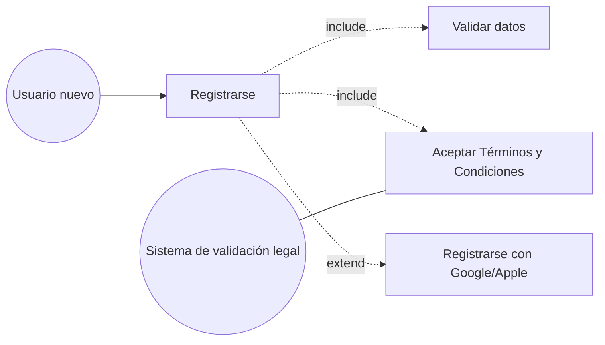
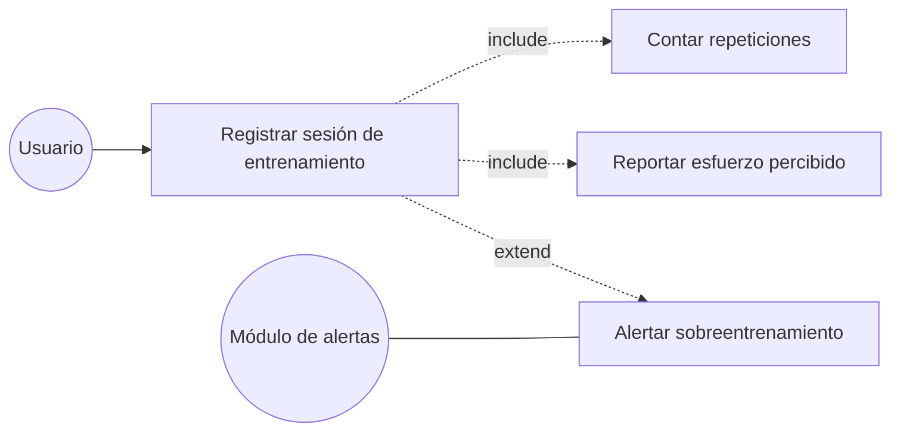
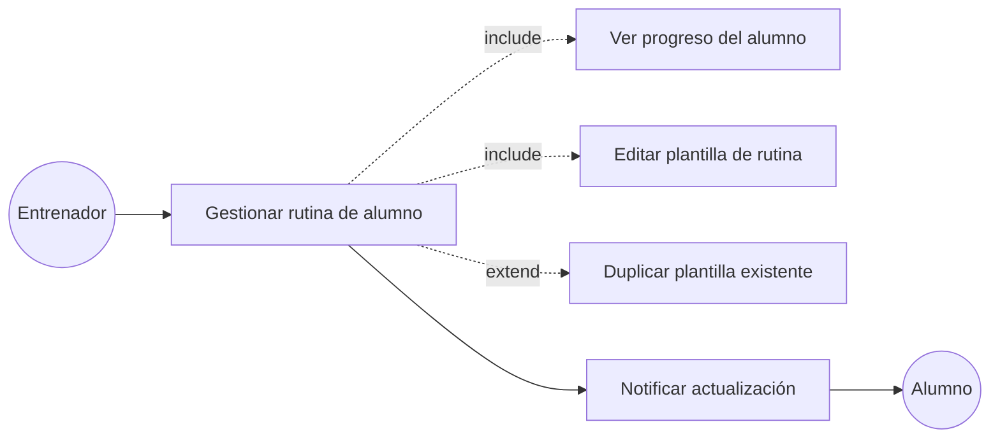

# 3. Casos de Uso (Unidad 5)

Se seleccionaron los 3 requisitos funcionales más complejos: **RF-01 (Onboarding freemium)**, **RF-03 (Registro de entrenamiento con prevención de lesiones)** y **RF-05 (Panel de gestión de rutinas para entrenadores)**.

---

## CU-01: Registrar usuario y completar onboarding

- **Actor principal:** Usuario nuevo
- **Actores secundarios:** Sistema de validación legal (módulo de Términos y Condiciones)

**Precondiciones**
- El usuario tiene la app instalada y no posee una cuenta previa.
- El usuario cuenta con conexión a internet.

**Flujo básico (happy path)**
1. El usuario abre la app y selecciona "Registrarme".
2. El sistema solicita email y contraseña (tap 1).
3. El usuario completa objetivo de entrenamiento y nivel (tap 2).
4. El usuario acepta los Términos y Condiciones (tap 3).
5. El sistema crea la cuenta en modo freemium y redirige a la pantalla principal.
6. El sistema habilita el botón "Hoy 20 minutos".

**Flujos alternativos**
- **A1 — Email ya registrado:** en el paso 2, si el email ya existe, el sistema muestra un error y ofrece recuperar contraseña; el usuario vuelve al paso 2.
- **A2 — Registro con Google/Apple:** el usuario puede omitir los pasos 2-3 autenticándose con un proveedor externo; el sistema autocompleta los datos básicos y solo pide objetivo/nivel y aceptación legal.

**Postcondiciones**
- Existe una cuenta de usuario activa en modo freemium.
- Quedó registrada la aceptación de Términos y Condiciones (requisito legal, Mara).

**Diagrama UML del caso de uso**

---

## CU-02: Registrar sesión de entrenamiento con prevención de lesiones

- **Actor principal:** Usuario
- **Actores secundarios:** Módulo de alertas de sobreentrenamiento

**Precondiciones**
- El usuario tiene una rutina activa (generada por "Hoy 20 minutos" o asignada por un entrenador).
- El usuario inició sesión en la app.

**Flujo básico (happy path)**
1. El usuario inicia la rutina del día.
2. Por cada ejercicio, el usuario toca el botón "+1 repetición" hasta completar la serie.
3. El sistema guarda las repeticiones completadas por ejercicio.
4. Al finalizar la rutina, el sistema solicita un reporte rápido de esfuerzo percibido.
5. El usuario indica su nivel de esfuerzo (escala simple).
6. El sistema guarda la sesión completa en el historial y actualiza el gráfico de progreso mensual.

**Flujos alternativos**
- **A1 — Esfuerzo elevado:** si en el paso 5 el usuario reporta un esfuerzo por encima del umbral seguro, el sistema muestra una alerta de posible sobreentrenamiento y sugiere un día de descanso antes de la próxima rutina.
- **A2 — Rutina abandonada a mitad de camino:** el usuario cierra la app antes del paso 4; el sistema guarda el progreso parcial y permite retomar la rutina la próxima vez que ingrese.

**Postcondiciones**
- La sesión de entrenamiento (repeticiones, esfuerzo) queda almacenada en el historial del usuario.
- El gráfico de progreso mensual refleja los nuevos datos.

**Diagrama UML del caso de uso**

---

## CU-03: Gestionar rutina de alumno desde panel de entrenador

- **Actor principal:** Entrenador
- **Actores secundarios:** Alumno (recibe la rutina actualizada)

**Precondiciones**
- El entrenador tiene una cuenta validada y al menos un alumno asignado.
- El alumno tiene una suscripción premium activa vinculada a ese entrenador.

**Flujo básico (happy path)**
1. El entrenador ingresa al panel y selecciona un alumno de su lista.
2. El sistema muestra el progreso histórico del alumno (repeticiones, esfuerzo, rutinas cumplidas).
3. El entrenador selecciona una plantilla de rutina existente o crea una nueva.
4. El entrenador ajusta cargas/repeticiones específicas para ese alumno.
5. El entrenador guarda los cambios.
6. El sistema notifica al alumno que su rutina fue actualizada.

**Flujos alternativos**
- **A1 — Duplicar plantilla:** en el paso 3, el entrenador puede duplicar una plantilla ya usada con otro alumno en lugar de crear una desde cero, para ahorrar tiempo.
- **A2 — Alumno sin suscripción activa:** si la suscripción premium del alumno venció, el sistema bloquea la edición y sugiere al entrenador contactar al alumno para renovarla.

**Postcondiciones**
- La rutina del alumno queda actualizada y visible en su app.
- El sistema registra el cambio para futura trazabilidad (auditoría del panel).

**Diagrama UML del caso de uso**

