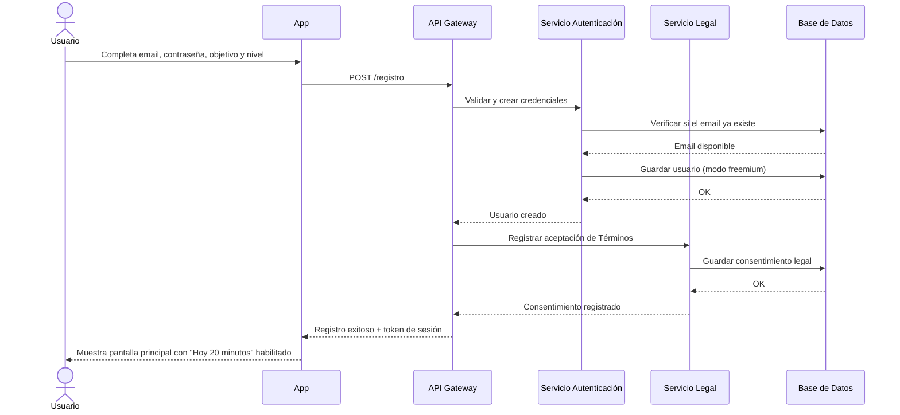
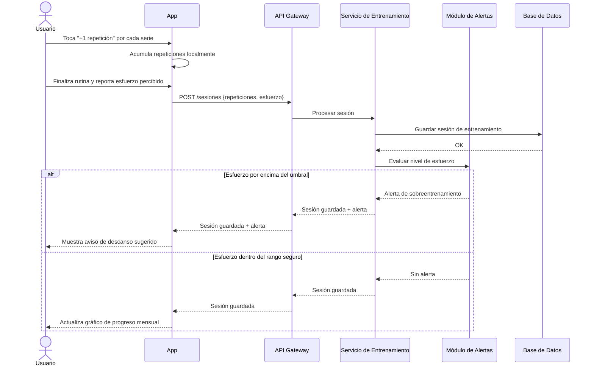
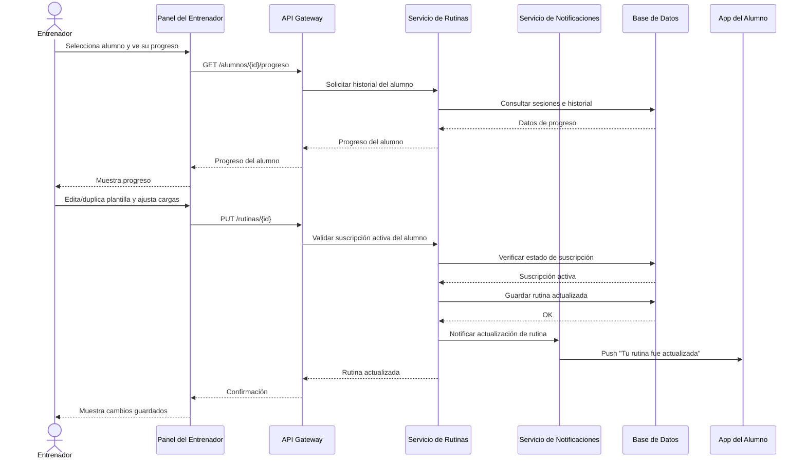

# 4. Diagramas de Interacción (Unidad 5)

Se optó por **Diagramas de Secuencia** para los tres casos de uso, ya que la temporalidad y el orden de los mensajes son especialmente relevantes en estos flujos (validaciones, alertas y notificaciones dependen del orden en que ocurren los eventos).

---

## Secuencia CU-01: Registrar usuario y completar onboarding

**Participantes:** Usuario, App (cliente), API Gateway, Servicio de Autenticación, Servicio Legal, Base de Datos

---

## Secuencia CU-02: Registrar sesión de entrenamiento con prevención de lesiones

**Participantes:** Usuario, App (cliente), API Gateway, Servicio de Entrenamiento, Módulo de Alertas, Base de Datos

---

## Secuencia CU-03: Gestionar rutina de alumno desde panel de entrenador

**Participantes:** Entrenador, Panel Web/App, API Gateway, Servicio de Rutinas, Servicio de Notificaciones, Base de Datos, App del Alumno

