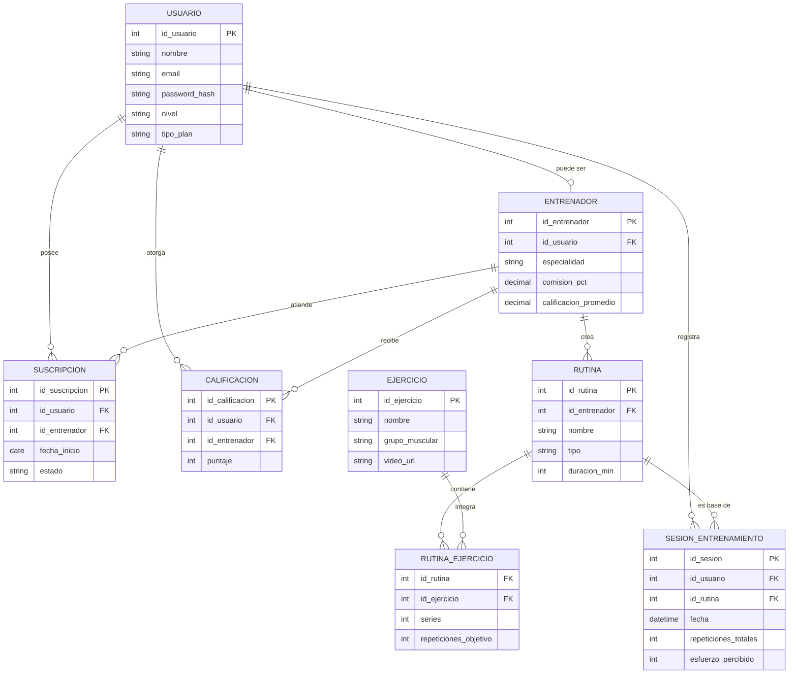

# 6. Modelado de Base de Datos (Unidad 6)

## Tablas principales

### 1. `Usuario`
| Campo | Tipo | Detalle |
|---|---|---|
| id_usuario | INT | **PK** |
| nombre | VARCHAR(100) | |
| email | VARCHAR(100) | único |
| password_hash | VARCHAR(255) | |
| nivel | VARCHAR(20) | principiante/intermedio/avanzado |
| tipo_plan | VARCHAR(20) | freemium/premium |
| fecha_registro | DATE | |

Almacena los datos de cuenta y perfil de entrenamiento de cada usuario, incluyendo si es freemium o premium.

### 2. `Entrenador`
| Campo | Tipo | Detalle |
|---|---|---|
| id_entrenador | INT | **PK** |
| id_usuario | INT | **FK** → Usuario |
| especialidad | VARCHAR(100) | |
| comision_pct | DECIMAL(5,2) | 20.00 - 30.00 |
| calificacion_promedio | DECIMAL(3,2) | calculada |

Extiende a un `Usuario` con los datos propios de su rol como entrenador (comisión, especialidad, reputación).

### 3. `Rutina`
| Campo | Tipo | Detalle |
|---|---|---|
| id_rutina | INT | **PK** |
| id_entrenador | INT | **FK** → Entrenador (nulo si es autogenerada) |
| nombre | VARCHAR(100) | |
| tipo | VARCHAR(30) | plantilla / "hoy 20 min" / personalizada |
| duracion_min | INT | |

Almacena las rutinas disponibles: plantillas de entrenadores, rutinas rápidas autogeneradas o personalizadas para un alumno puntual.

### 4. `Ejercicio`
| Campo | Tipo | Detalle |
|---|---|---|
| id_ejercicio | INT | **PK** |
| nombre | VARCHAR(100) | |
| grupo_muscular | VARCHAR(50) | |
| nivel_dificultad | VARCHAR(20) | |
| video_url | VARCHAR(255) | referencia al streaming CDN |

Catálogo de ejercicios de calistenia disponibles, con referencia al video servido por streaming (no se guarda el archivo, solo la URL).

### 5. `Rutina_Ejercicio` (tabla asociativa)
| Campo | Tipo | Detalle |
|---|---|---|
| id_rutina | INT | **FK** → Rutina (parte de PK compuesta) |
| id_ejercicio | INT | **FK** → Ejercicio (parte de PK compuesta) |
| series | INT | |
| repeticiones_objetivo | INT | |
| orden | INT | |

Resuelve la relación N:M entre `Rutina` y `Ejercicio`: una rutina tiene varios ejercicios, y un ejercicio puede aparecer en varias rutinas, con parámetros propios de cada combinación (series, repeticiones, orden).

### 6. `Sesion_Entrenamiento`
| Campo | Tipo | Detalle |
|---|---|---|
| id_sesion | INT | **PK** |
| id_usuario | INT | **FK** → Usuario |
| id_rutina | INT | **FK** → Rutina |
| fecha | DATETIME | |
| repeticiones_totales | INT | |
| esfuerzo_percibido | INT | escala 1-10 |
| alerta_generada | BOOLEAN | |

Guarda el **historial de entrenamientos**: cada vez que un usuario completa una rutina, se registra una fila con lo realmente ejecutado (no lo planeado), habilitando el gráfico de progreso mensual.

### 7. `Suscripcion`
| Campo | Tipo | Detalle |
|---|---|---|
| id_suscripcion | INT | **PK** |
| id_usuario | INT | **FK** → Usuario |
| id_entrenador | INT | **FK** → Entrenador (nulo si no tiene entrenador asignado) |
| fecha_inicio | DATE | |
| fecha_fin | DATE | |
| estado | VARCHAR(20) | activa/vencida/cancelada |

Almacena el estado premium del usuario y, si corresponde, a qué entrenador está vinculado (necesario para calcular comisiones).

### 8. `Calificacion`
| Campo | Tipo | Detalle |
|---|---|---|
| id_calificacion | INT | **PK** |
| id_usuario | INT | **FK** → Usuario |
| id_entrenador | INT | **FK** → Entrenador |
| puntaje | INT | 1-5 |
| comentario | VARCHAR(300) | |
| fecha | DATE | |

Guarda las calificaciones que los alumnos dan a sus entrenadores, usadas para calcular `calificacion_promedio`.

---

## Diagrama Entidad-Relación

**Cardinalidades:**
- `Usuario` 1:1(opcional) `Entrenador` — un usuario puede o no tener un perfil de entrenador.
- `Entrenador` 1:N `Rutina` — un entrenador crea muchas rutinas; una rutina pertenece a un solo entrenador (o ninguno, si es autogenerada).
- `Rutina` N:M `Ejercicio`, resuelta mediante `Rutina_Ejercicio`.
- `Usuario` 1:N `Sesion_Entrenamiento` — un usuario registra muchas sesiones a lo largo del tiempo.
- `Usuario` 1:N `Suscripcion` y `Entrenador` 1:N `Suscripcion` — un entrenador atiende a muchos alumnos suscriptos.
- `Usuario` 1:N `Calificacion` y `Entrenador` 1:N `Calificacion` — cada alumno puede calificar varias veces (por ciclo) y cada entrenador acumula muchas calificaciones.

**Claves foráneas necesarias:** `Entrenador.id_usuario`, `Rutina.id_entrenador`, `Rutina_Ejercicio.id_rutina`, `Rutina_Ejercicio.id_ejercicio`, `Sesion_Entrenamiento.id_usuario`, `Sesion_Entrenamiento.id_rutina`, `Suscripcion.id_usuario`, `Suscripcion.id_entrenador`, `Calificacion.id_usuario`, `Calificacion.id_entrenador`.

---

## Consideraciones de normalización

El modelo se llevó a **Tercera Forma Normal (3FN)**: cada tabla representa una única entidad (usuario, rutina, ejercicio, sesión) sin datos repetidos ni dependencias transitivas. Por ejemplo, `calificacion_promedio` en `Entrenador` es un dato derivado que se recalcula a partir de `Calificacion` (no se duplica manualmente), y los datos de ejercicio (nombre, grupo muscular) viven una sola vez en `Ejercicio`, referenciados desde cualquier rutina que los use.

## Tabla asociativa para relaciones N:M

Sí: `Rutina_Ejercicio` resuelve la relación N:M entre `Rutina` y `Ejercicio` (una rutina tiene muchos ejercicios, y un mismo ejercicio se reutiliza en muchas rutinas), agregando además atributos propios de esa combinación (series, repeticiones objetivo, orden dentro de la rutina).

## Historial de entrenamientos y progreso del usuario

Se maneja con la tabla `Sesion_Entrenamiento`, que guarda una fila por cada rutina efectivamente completada (fecha, repeticiones totales, esfuerzo percibido, si se generó alerta). El gráfico de progreso mensual (RF-04) se construye agregando estas filas por usuario y por mes, y el sistema de prevención de lesiones (RF-03) consulta el campo `esfuerzo_percibido` de las últimas sesiones para decidir si emite una alerta de sobreentrenamiento.
